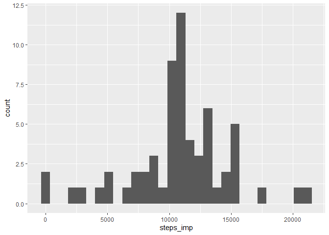
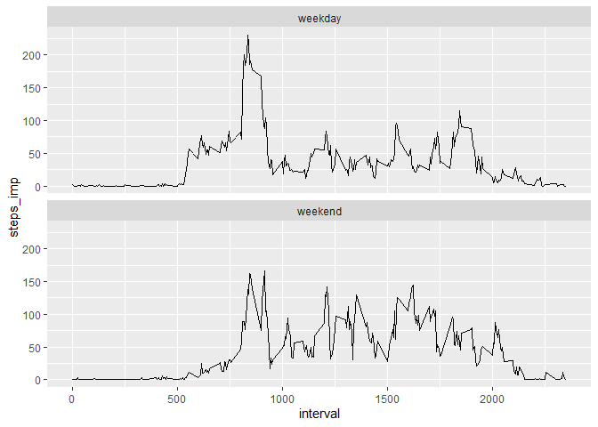

## Loading and preprocessing the data


```r
## Install and load packages

packages = c("tidyverse", "lubridate","ggplot2")

## Now load or install & load all
package.check <- lapply(
  packages,
  FUN = function(x) {
    if (!require(x, character.only = TRUE)) {
      install.packages(x, dependencies = TRUE)
      library(x, character.only = TRUE)
    }
  }
)

# Load data
act<-read.csv("Input/data/activity.csv",header = TRUE,sep=",")


# check the variable class. All of them are character.
act %>% apply(2,class)
```

```
##       steps        date    interval 
## "character" "character" "character"
```

```r
# Transform to numeric and date
act$steps<-as.numeric(act$steps)
act$interval<-as.numeric(act$interval)
act$date<-ymd(act$date)

summary(act)
```

```
##      steps             date               interval     
##  Min.   :  0.00   Min.   :2012-10-01   Min.   :   0.0  
##  1st Qu.:  0.00   1st Qu.:2012-10-16   1st Qu.: 588.8  
##  Median :  0.00   Median :2012-10-31   Median :1177.5  
##  Mean   : 37.38   Mean   :2012-10-31   Mean   :1177.5  
##  3rd Qu.: 12.00   3rd Qu.:2012-11-15   3rd Qu.:1766.2  
##  Max.   :806.00   Max.   :2012-11-30   Max.   :2355.0  
##  NA's   :2304
```


## What is mean total number of steps taken per day?

Calculate the total number of steps taken per day


```r
act %>% group_by(date) %>% summarise(steps=sum(steps)) 
```

```
## # A tibble: 61 x 2
##    date       steps
##    <date>     <dbl>
##  1 2012-10-01    NA
##  2 2012-10-02   126
##  3 2012-10-03 11352
##  4 2012-10-04 12116
##  5 2012-10-05 13294
##  6 2012-10-06 15420
##  7 2012-10-07 11015
##  8 2012-10-08    NA
##  9 2012-10-09 12811
## 10 2012-10-10  9900
## # ... with 51 more rows
```

If you do not understand the difference between a histogram and a barplot, research the difference between them. Make a histogram of the total number of steps taken each day


```r
act %>% group_by(date) %>% summarise(steps=sum(steps)) %>% ggplot(aes(x=steps))+geom_histogram()
```

<!-- -->

Calculate and report the mean and median of the total number of steps taken per day


```r
a<-act %>% group_by(date) %>% summarise(steps=sum(steps)) %>% select(steps) %>% as.data.frame()
mean(a$steps,na.rm = TRUE)
```

```
## [1] 10766.19
```

```r
median(a$steps,na.rm = TRUE)
```

```
## [1] 10765
```


## What is the average daily activity pattern?

Make a time series plot of the 5-minute interval (x-axis) and the average number of steps taken, averaged across all days (y-axis)


```r
act %>% group_by(interval) %>% summarise(steps=mean(steps,na.rm=TRUE)) %>% 
  ggplot(aes(x=interval,y=steps))+geom_line()
```

<!-- -->

Which 5-minute interval, on average across all the days in the dataset, contains the maximum number of steps?


```r
# The interval 835 is that contains the maximum number of steps on average (206)
act %>% group_by(interval) %>% summarise(steps=mean(steps,na.rm=TRUE)) %>%  arrange(-steps) %>% head()
```

```
## # A tibble: 6 x 2
##   interval steps
##      <dbl> <dbl>
## 1      835  206.
## 2      840  196.
## 3      850  183.
## 4      845  180.
## 5      830  177.
## 6      820  171.
```


## Imputing missing values


```r
# Calculate and report the total number of missing values in the dataset
# There are 2304 rows with missing values in the data set
act %>% filter(is.na(steps)) %>% count()
```

```
##      n
## 1 2304
```

```r
# Devise a strategy for filling in all of the missing values in the dataset. The strategy does not need to be sophisticated. For example, you could use the mean/median for that day, or the mean for that 5-minute interval, etc.

a<-act %>% group_by(interval) %>% summarise(mean_interval=mean(steps,na.rm=TRUE))
act<-merge(act,a,by="interval",all.x = TRUE)

# Create a new dataset that is equal to the original dataset but with the missing data filled in.
act<-act %>% mutate(steps_imp = case_when(!is.na(steps) ~ steps,
               TRUE ~ mean_interval))

act %>% filter(is.na(steps_imp)) %>% count()
```

```
##   n
## 1 0
```

```r
# Make a histogram of the total number of steps taken each day and Calculate and report the mean and median total number of steps taken per day. Do these values differ from the estimates from the first part of the assignment? What is the impact of imputing missing data on the estimates of the total daily number of steps?

act %>% group_by(date) %>% summarise(steps_imp=sum(steps_imp)) %>% ggplot(aes(x=steps_imp))+geom_histogram()
```

<!-- -->

```r
a<-act %>% group_by(date) %>% summarise(steps_imp=sum(steps_imp)) %>% select(steps_imp) %>% as.data.frame()
mean(a$steps_imp,na.rm = TRUE)
```

```
## [1] 10766.19
```

```r
median(a$steps_imp,na.rm = TRUE)
```

```
## [1] 10766.19
```

The mean is the same (10766) but the median increase from 10765 to 10766.


## Are there differences in activity patterns between weekdays and weekends?

Create a new factor variable in the dataset with two levels – “weekday” and “weekend” indicating whether a given date is a weekday or weekend day.


```r
act<-act %>% mutate(weekdays=weekdays(date),
               weekdays_dicotomic=case_when(weekdays=="domingo"~"weekend",
                                            weekdays=="sábado"~"weekend",
                                            TRUE~"weekday"),
               weekdays_dicotomic=as.factor(weekdays_dicotomic))


table(act$weekdays_dicotomic)
```

```
## 
## weekday weekend 
##   12960    4608
```


Make a panel plot containing a time series plot of the 5-minute interval (x-axis) and the average number of steps taken, averaged across all weekday days or weekend days (y-axis). See the README file in the GitHub repository to see an example of what this plot should look like using simulated data.


```r
act %>% group_by(interval,weekdays_dicotomic) %>% summarise(steps_imp=mean(steps_imp)) %>% as.data.frame() %>% 
  ggplot(aes(x=interval,y=steps_imp)) + geom_line() + facet_wrap(~weekdays_dicotomic,ncol=1)
```

<!-- -->


